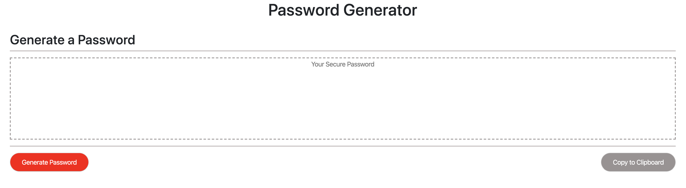

# Password-Generator

Deployed: https://phoenix-99hp.github.io/Password-Generator/

This is a random password generator. Click the 'Generate Password' button to initiate a prompt that will ask the user to specify how many characters the password should be. Next, the user will be asked to specify what type of characters the password should include through a series of confirms - choosing 'OK' will allow the relevant character type, while choosing 'Cancel' will prevent that character type from being used. The 'Copy to Clipboard' button enables the user to copy the password and paste it to the desired location.

